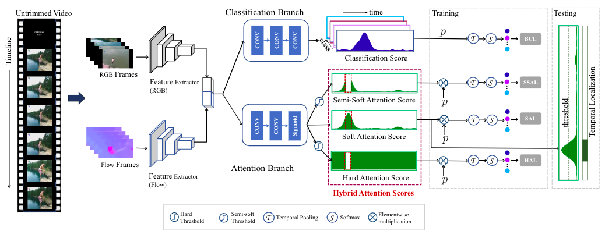

<div align="center">    

# HAM-Net
[](https://arxiv.org/abs/2101.00545)
[](https://aaai.org/Conferences/AAAI-21/)

</div>


This repository contains code for the AAAI 2021 paper: 

**[A Hybrid Attention Mechanism for Weakly-Supervised Temporal Action Localization](https://arxiv.org/abs/2101.00545)**

## Overview

<p align="center">
  
</p>


## Prerequisites

- PyTorch 1.7.1 
- pytorch-lightning 1.1.2
- loguru, colorama, etc. 

Older versions of PyTorch(1.3+) and pytorch-lightning(0.9+) should also work but not tested. 

You can create a new conda environment with all the dependencies using:
```
conda env create -f environment.yml
```

## How to Run

### Download Data

The ground-truth and I3D features for THUMOS14 and ActivitiNet1.2 dataset can be downloaded from here:

[Box Download Link](https://rpi.box.com/s/hf6djlgs7vnl7a2oamjt0vkrig42pwho)

Please put the downloaded files/folders under `data/` directory.

### Training

To train HAM-Net on *Thumos14* dataset:

```python

python main.py
```

Please check `options.py` to know more about the available cli arguments.

### Testing

To evaluate on *Thumos14* dataset:

```python

python main.py --test --ckpt [checkpoint_path]
```

For ActivityNet-1.2, use `main_anet.py` script.


## Citation

If you find this repo useful for your research, please consider citing the paper:

```
@misc{islam2021hybrid,
      title={A Hybrid Attention Mechanism for Weakly-Supervised Temporal Action Localization}, 
      author={Ashraful Islam and Chengjiang Long and Richard J. Radke},
      year={2021},
      eprint={2101.00545},
      archivePrefix={arXiv},
      primaryClass={cs.CV}
}
``` 

## Acknowledgement

- [BaSNet](https://github.com/Pilhyeon/BaSNet-pytorch)
- [ActivityNet](https://github.com/activitynet/ActivityNet)
- [WSAD](https://github.com/asrafulashiq/wsad)
